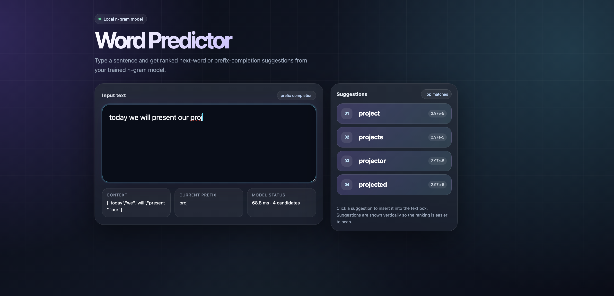

# NLP-project



Project folder overivew 

```
NLP-Project/

├── data/
│   ├── raw/
│   ├── processed/
│   └── splits/
│       ├── train.txt
│       ├── valid.txt
│       └── test.txt
│
├── models/
│   ├── ngram/
│   └── transformer/
│
├── results/
│   ├── metrics/
│   └── plots/
│
├── src/
│   ├── preprocessing.py
│   ├── tokenizer.py
│   ├── ngram_model.py
│   ├── transformer_model.py
│   ├── spell_corrector.py
│   ├── suggestion_engine.py
│   ├── evaluate.py
│   └── gui_app.py
│
├── main.py
├── requirements.txt
└── README.md
```

## Do the following to test the word predictor, run first the folllowing command:

```bash
 python scr/ngram/ngram_train.py 
 ``` 

 ## The run the gui and start typing

 ```bash 
 python scr/gui_app.py
 ```


 # Results

 ## Summary of Language Model Evaluation

The best interpolation weights found during tuning were:

| N-gram model | Lambda weight |
|---|---:|
| Unigram (1-gram) | 0.0 |
| Bigram (2-gram) | 0.0 |
| Trigram (3-gram) | 0.1 |
| 4-gram | 0.9 |

This means the final model relies mostly on the **4-gram model**, with a small contribution from the **3-gram model**.

## Best Validation Result

The best validation performance was obtained with:

- **Top-k:** 3 suggestions
- **Saved keystrokes:** 122,158
- **Saved keystroke ratio:** 68.04%
- **Top-k accuracy:** 51.48%
- **Success rate:** 95.40%
- **Appeared rate:** 99.88%
- **Mean characters typed before suggestion:** 1.24

This means that when showing the top 3 suggestions, the correct word appeared in the suggestions about **51.5%** of the time. The system also saved about **68%** of the total characters that would otherwise have been typed.

## Test Results by Number of Suggestions

| Top-k | Top-k accuracy | Saved keystroke ratio | Saved keystrokes |
|---:|---:|---:|---:|
| 1 | 32.53% | 57.80% | 147,550 |
| 2 | 44.10% | 65.61% | 167,488 |
| 3 | 51.42% | 68.03% | 173,665 |
| 4 | 56.47% | 69.29% | 176,900 |

Increasing the number of suggestions improves both accuracy and saved keystrokes. However, the improvement becomes smaller after `top_k = 3`. For example, going from 3 to 4 suggestions only increases the saved keystroke ratio from **68.03%** to **69.29%**.

## Cross-Entropy and Perplexity

The model achieved:

- **Cross-entropy:** 5.55
- **Perplexity:** 258.52

The perplexity means that, on average, the model is about as uncertain as choosing between **258 possible next words**. A lower perplexity would indicate a better language model, but this value is reasonable for a simple word-level n-gram model.

## Conclusion

The best tuned model used interpolation weights of **λ₃ = 0.1** and **λ₄ = 0.9**, meaning it mainly depends on 4-word context. With `top_k = 3`, the model achieved a good balance between prediction quality and usability, reaching **51.42% top-k accuracy** and saving about **68.03%** of keystrokes on the test set. Although `top_k = 4` gives the highest accuracy and keystroke savings, `top_k = 3` is a reasonable tradeoff because it gives strong performance while showing fewer suggestions.